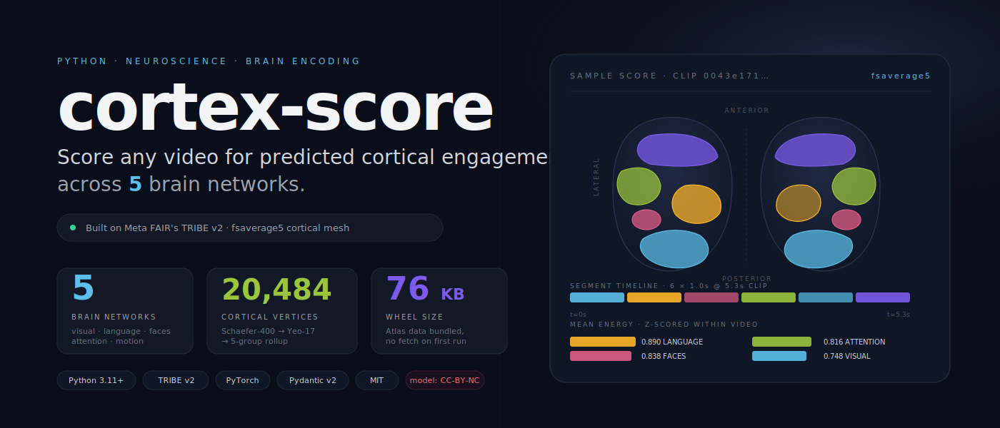
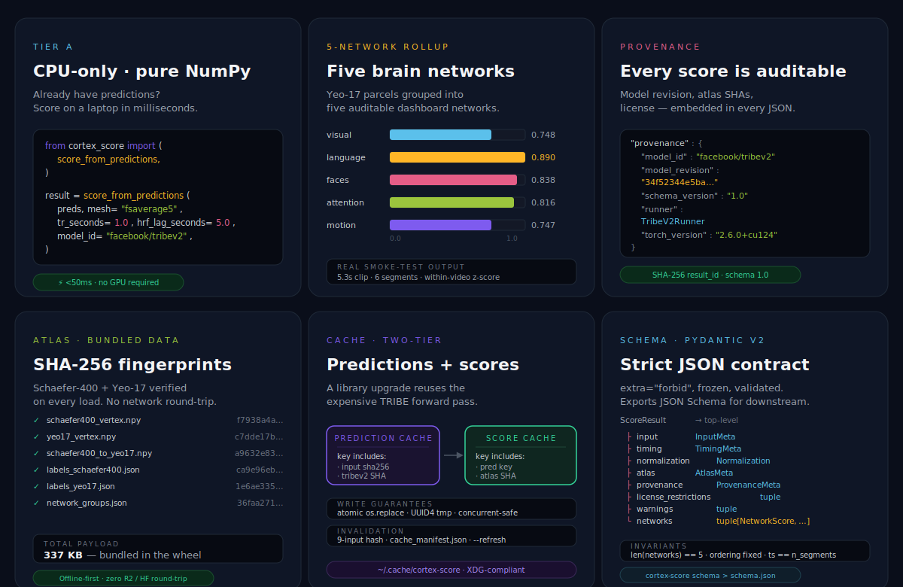
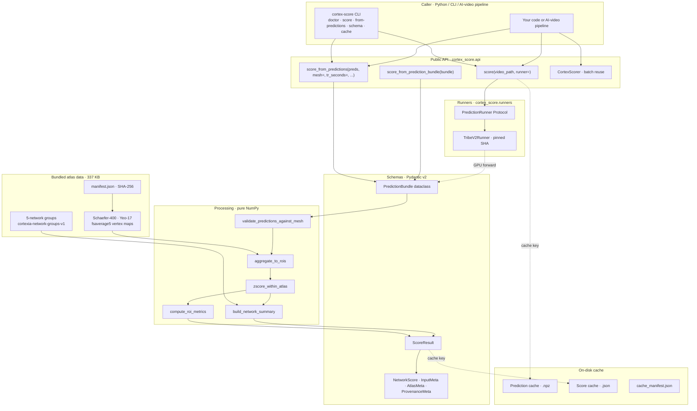
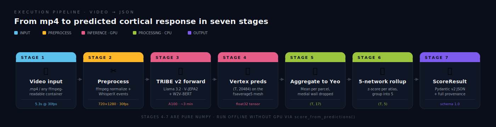
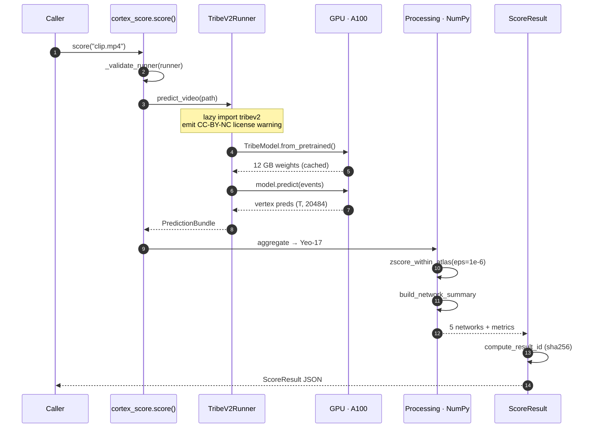
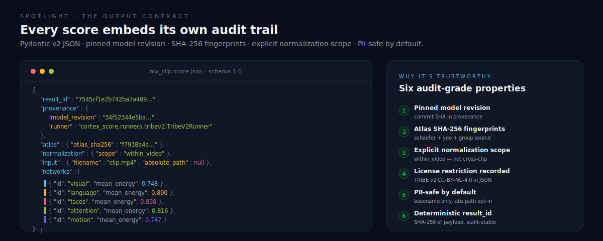
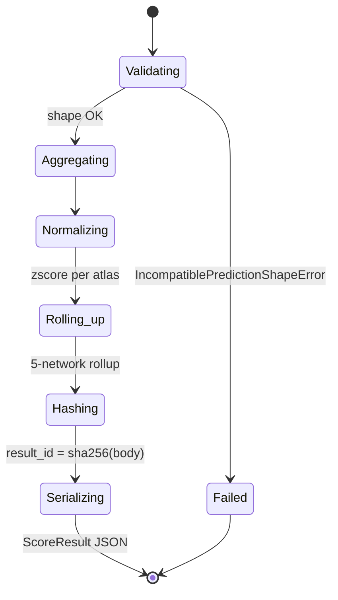

<div align="center">



[](https://www.python.org/)
[](https://pytorch.org/)
[](https://docs.pydantic.dev/latest/)
[](https://hatch.pypa.io/)
[](https://docs.astral.sh/ruff/)
[](https://mypy.readthedocs.io/)
[](https://docs.pytest.org/)
[](LICENSE)
[](https://huggingface.co/facebook/tribev2)

**Score any video for predicted cortical engagement across 5 brain networks.**

[Overview](#overview) · [Features](#features) · [Architecture](#architecture) · [Output](#output-anatomy) · [Quickstart](#getting-started) · [API](#api) · [Schema](#json-schema) · [Palette](#network-palette) · [Licenses](#licenses)

</div>

---

## Overview

`cortex-score` predicts how a video would activate different parts of the brain. Drop in any mp4 and get back a JSON breakdown of how strongly five regions — **visual, language, faces, attention, motion** — are likely to engage. The numbers come from **Meta FAIR's TRIBE v2**, an AI model trained on fMRI scans of people watching videos.

**Useful for:**

- Ranking or filtering a video library by which clips engage which brain regions
- Building creative tools that need a richer, structured signal than view count or watch time
- Research on what visual, linguistic, or social content a clip is loaded with — without recording your own fMRI
- Dropping into AI-video pipelines as a content-understanding step before re-cuts, captions, or recommendations

**Not a brain scan.** These are AI predictions, not measurements of any real viewer. Treat them as a creative signal, not a clinical one.

### Two ways to use it

- `score("clip.mp4")` — full pipeline. Runs TRIBE v2 end-to-end on a GPU. Requires the `[gpu-deps]` extra plus TRIBE v2 itself (installed separately because PyPI rejects Git-URL deps).
- `score_from_predictions(preds, ...)` — CPU-only postprocessing. Hand it a `(T, 20484)` prediction tensor you computed elsewhere; the package aggregates, normalizes, and emits the same JSON in milliseconds on a laptop.

---

## Features



| Capability | Detail |
|---|---|
| **CPU-only tier** | `score_from_predictions(preds, mesh=..., tr_seconds=..., model_id=..., model_revision=...)` — explicit-metadata API; runs on a laptop in <50 ms |
| **5-network rollup** | Yeo-17 parcels grouped into auditable dashboard networks; the grouping JSON is bundled and SHA-fingerprinted |
| **Pinned provenance** | Every `ScoreResult` carries `model_revision`, atlas SHAs, normalization scope, license restrictions, Python/torch versions |
| **Atlas integrity** | Schaefer-400 + Yeo-17 + group definition checked against `data/manifest.json` SHA-256 on every load |
| **Two-tier cache** | Prediction cache (keyed on input + model revision) + score cache (keyed on prediction + library version); atomic writes via `os.replace` + UUID4 tmp |
| **Strict JSON schema** | Pydantic v2 with `extra="forbid"`, `frozen=True`, 5-network invariants, OpenAPI export via `cortex-score schema` |

---

## Architecture



### Execution pipeline



### Request lifecycle



---

## Output anatomy



Every score is a self-describing JSON object. The contract is locked behind `SCHEMA_VERSION = "1.0"`; any breaking change bumps it explicitly.

| Field | What it gives you |
|---|---|
| `result_id` | SHA-256 of the payload — a stable id for caches, audit logs, dedup |
| `provenance.model_revision` | Which TRIBE v2 commit produced the numbers (`34f52344e5ba…`) |
| `atlas.*_sha256` | Fingerprints of the exact Schaefer / Yeo / network-group data used |
| `normalization.scope` | `within_video` by default — two clips are NOT comparable on the same axis unless you opt into a reference distribution |
| `license_restrictions[]` | TRIBE v2 CC-BY-NC-4.0 recorded in-band so downstream code can't lose track of it |
| `input.filename` / `absolute_path` | Basename only by default; absolute path is opt-in to keep shareable JSON free of usernames or local paths |
| `framing` family | Three short human-readable strings baked into the JSON so the context follows the artifact wherever it goes |

---

## Tech stack

| Layer | Choice | Why |
|---|---|---|
| Language | Python 3.11+ | Matches TRIBE v2's `requires-python`; native `datetime.UTC`, `Self` type, structural pattern matching |
| Schema | Pydantic v2 | Frozen models, `extra="forbid"`, runtime validation, free JSON Schema export |
| Build | `hatchling` + `hatch-vcs` | Git-tag-driven versioning (`0.1.dev2+g4301e2dff` derived from commit); standard scientific-Python tooling |
| CLI | `typer` (optional `[cli]` extra) | First-class `--help`, gracefully degrades if extra not installed |
| Cache dirs | `platformdirs` | XDG on Linux/macOS, `%LOCALAPPDATA%` on Windows, env override via `CORTEX_SCORE_CACHE_DIR` |
| Atlas data | Bundled (`importlib.resources`) | 337 KB total — Schaefer 2018 + Yeo 2011 projection on fsaverage5, SHA-256 fingerprinted |
| Encoder | TRIBE v2 @ `34f52344` (Meta FAIR) | Llama 3.2-3B + V-JEPA2 + W2V-BERT; pinned to commit, installed from `requirements/tribev2-gpu.txt` |
| Testing | `pytest` + `hypothesis` + property tests | 125 tests, 87.95% coverage, snapshot fixtures, cache-invalidation matrix, packaging gate |
| Lint / Type | `ruff` + `mypy --strict` | Zero warnings in CI; `extra="forbid"` Pydantic surfaces extra-field bugs at runtime too |
| Distribution | PyPI-ready wheel | 76 KB pure-Python `py3-none-any.whl`, atlas data force-included via Hatch |

---

## Getting started

### Install

```bash
pip install cortex-score                                  # base · CPU postprocessing tier
pip install "cortex-score[cli]"                           # + typer CLI
pip install "cortex-score[gpu-deps]"                      # + TRIBE-compatible GPU matrix
pip install -r requirements/tribev2-gpu.txt               # + TRIBE v2 (pinned commit)
huggingface-cli login                                     # gated LLaMA 3.2-3B
```

### 30-second example · full pipeline

```python
from cortex_score import score

result = score("my_clip.mp4")
for net in result.networks:
    print(f"{net.id:>9}  mean={net.mean_energy:.3f}  peak={net.peak_energy:.3f}")
result.save("my_clip.score.json")
```

### CPU-only tier · no GPU required

```python
import numpy as np
from cortex_score import score_from_predictions

preds = np.load("preds_vertex.npy")  # (T, 20484) from any TRIBE v2 run
result = score_from_predictions(
    preds,
    mesh="fsaverage5",
    tr_seconds=1.0,
    hrf_lag_seconds=5.0,
    model_id="facebook/tribev2",
    model_revision="34f52344e5ba96660fac877393e1954e399d3ef3",
)
print(result.to_json(indent=2))
```

### Batch reuse · `CortexScorer`

```python
from cortex_score import CortexScorer

scorer = CortexScorer()  # loads TRIBE v2 once
for clip in Path("clips").glob("*.mp4"):
    scorer.score(clip).save(out_dir / f"{clip.stem}.json")
```

### Diagnose your environment

```bash
cortex-score doctor               # checks Python, torch, tribev2, ffmpeg, uv, hf-token, cache dir
cortex-score schema > schema.json # OpenAPI / JSON Schema of ScoreResult
cortex-score cache info           # cache root + counts
```

---

## API

### Public entry points

| Function | Signature | Use when |
|---|---|---|
| `score_from_prediction_bundle` | `(bundle: PredictionBundle, *, config=, input_meta=) -> ScoreResult` | You constructed a validated bundle yourself (type-safe form) |
| `score_from_predictions` | `(preds, *, mesh, tr_seconds, hrf_lag_seconds, model_id, model_revision, source="npy", segments=None, config=, input_meta=) -> ScoreResult` | You have a `(T, V)` NumPy tensor and want a friendly API; mandatory metadata kwargs |
| `score` | `(video_path, *, runner=None, config=None) -> ScoreResult` | You have a video file path; default runner is `TribeV2Runner` (requires `[gpu-deps]` + TRIBE) |
| `CortexScorer(runner=, config=)` | class · `.score(path)` | Batch scoring; loads TRIBE once and reuses |

### Runner protocol

Plug in your own encoder by implementing the protocol — `score()` is encoder-agnostic.

```python
from pathlib import Path
from cortex_score.runners import PredictionRunner
from cortex_score.schemas import PredictionBundle

class MyRunner:
    model_id: str = "my-org/my-encoder"
    model_revision: str = "v0.3"

    def predict_video(self, path: Path) -> PredictionBundle:
        ...  # your inference, return a PredictionBundle on fsaverage5
```

### Exceptions

| Exception | Raised when |
|---|---|
| `MissingOptionalDependencyError` | `[gpu-deps]` or `tribev2` not installed when `score()` is called without an explicit runner |
| `MissingExternalToolError` | `ffmpeg` / `uvx` absent on PATH at TRIBE-load time |
| `IncompatiblePredictionShapeError` | `preds.shape[1]` does not match the mesh's vertex count |
| `AtlasMismatchError` | Bundled atlas SHA-256 disagrees with `data/manifest.json` (corrupted wheel) |
| `ModelLicenseError` | Reserved for opt-in `--strict-license` mode |
| `PreprocessingWarning` | Emitted (not raised) when a clip is letterboxed or aspect-resampled |

---

## JSON schema



The top-level shape:

```jsonc
{
  "schema_version": "1.0",
  "result_id":       "<sha256 of canonical body>",
  "created_at":      "2026-05-22T02:53:55Z",
  "framing":         "Score any video for predicted cortical engagement...",
  "framing_scientific":   "cortex-score summarizes TRIBE v2 predicted cortical responses...",
  "framing_disclaimer":   "cortex-score does not measure real viewer engagement...",
  "input":           { "filename": "...", "absolute_path": null, "content_sha256": "..." },
  "timing":          { "tr_seconds": 1.0, "hrf_lag_seconds": 5.0, "n_segments": 6 },
  "normalization":   { "method": "zscore", "scope": "within_video", "epsilon": 1e-6 },
  "atlas":           { "atlas_sha256": "...", "yeo_atlas_sha256": "...", "network_groups_sha256": "..." },
  "provenance":      { "model_revision": "34f52344e5ba…", "runner": "...", "torch_version": "2.6.0+cu124" },
  "license_restrictions": [ { "component": "TRIBE v2", "license": "CC-BY-NC-4.0", "note": "..." } ],
  "warnings":        [],
  "networks": [
    { "id": "visual",    "yeo_indices": [0, 1],    "mean_energy": 0.748, "peak_energy": 2.149, ... },
    { "id": "language",  "yeo_indices": [11, 16],  "mean_energy": 0.890, "peak_energy": 1.320, ... },
    { "id": "faces",     "yeo_indices": [7, 15],   "mean_energy": 0.838, "peak_energy": 1.690, ... },
    { "id": "attention", "yeo_indices": [4,5,6,10],"mean_energy": 0.816, "peak_energy": 1.596, ... },
    { "id": "motion",    "yeo_indices": [2, 3],    "mean_energy": 0.747, "peak_energy": 2.082, ... }
  ]
}
```

Generate the canonical JSON Schema for downstream validators:

```bash
cortex-score schema > cortex-score.schema.json
```

---

## Network palette

The five-network palette comes straight from the Cortexia design system. Use these exact hex values when visualizing `cortex-score` output downstream — they are also embedded in `network_groups.json` and exposed via `NetworkScore.color`.

| Network | Hex | RGB | Yeo parcels |
|---|---|---|---|
| **visual** ·  | `#5BC0EB` | `(91, 192, 235)` | `VisCent`, `VisPeri` |
| **language** ·  | `#FFB627` | `(255, 182, 39)` | `ContB`, `TempPar` |
| **faces** ·  | `#E55D87` | `(229, 93, 135)` | `SalVentAttnB`, `DefaultC` |
| **attention** ·  | `#9BC53D` | `(155, 197, 61)` | `DorsAttnA`, `DorsAttnB`, `SalVentAttnA`, `ContA` |
| **motion** ·  | `#7E5BEF` | `(126, 91, 239)` | `SomMotA`, `SomMotB` |

The grouping itself (`network_groups.json`) is **product-design**, not canonical neuroscience — its provenance is recorded as `network_group_source: "cortexia-network-groups-v1"` in every result and SHA-fingerprinted in `data/manifest.json`.

---

## Licenses

This repository is governed by **two layers of licensing** — read both before commercial use.

| Layer | License | Applies to |
|---|---|---|
| Source code | **MIT** | The `cortex_score` Python package |
| Schaefer 2018 atlas | MIT (CBIG) | `data/schaefer400_vertex.npy`, `labels_schaefer400.json` |
| Yeo 2011 atlas | FreeSurfer (BSD-like) | `data/yeo17_vertex.npy`, `labels_yeo17.json` |
| 5-network grouping | MIT (Cortexia) | `data/network_groups.json` |
| **TRIBE v2 model** | **CC-BY-NC-4.0** | Outputs from the full `score()` pipeline inherit the non-commercial restriction |

See [`LICENSE-THIRD-PARTY.md`](LICENSE-THIRD-PARTY.md) for the full notice and citation pointers. The CC-BY-NC warning is also emitted as a Python `UserWarning` on first TRIBE load and recorded in every `ScoreResult.license_restrictions`.

---

## Reproducibility

Real smoke-test numbers from a Modal A100 run on Cortexia clip `0043e171…` (5.3 s, short-form vertical):

| Metric | Value |
|---|---|
| GPU runtime | **175.5 s** |
| Wall clock (incl. cold start) | 184.5 s |
| Estimated GPU spend | **$0.11** |
| Peak VRAM | 10.80 GB |
| Predicted segments | 6 / 100 (TRIBE-filtered) |
| Cortex-score version | `0.1.dev2+g4301e2dff` |
| TRIBE v2 commit | `34f52344e5ba96660fac877393e1954e399d3ef3` |

```bash
modal run examples/modal_smoke.py
```

---

<div align="center">

**MIT-licensed source · CC-BY-NC-4.0 model outputs · No PyPI publish yet**

Built by [**@madhavcodez**](https://github.com/madhavcodez) · pre-release v0.1 candidate

_Make a brain-encoding model accessible to anyone with a clip._

</div>
