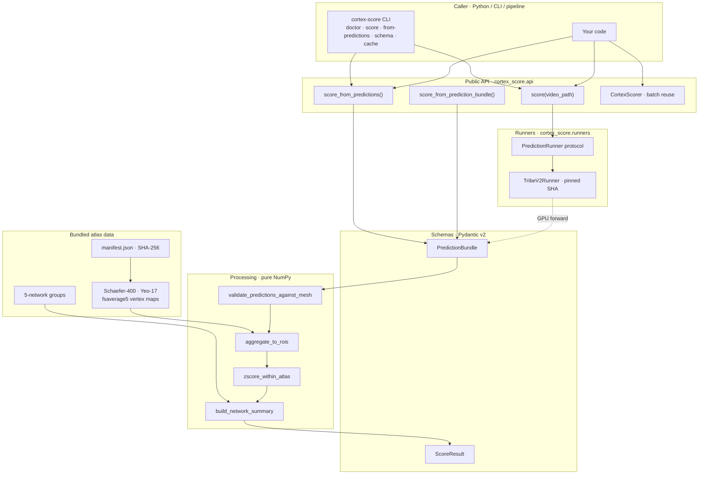
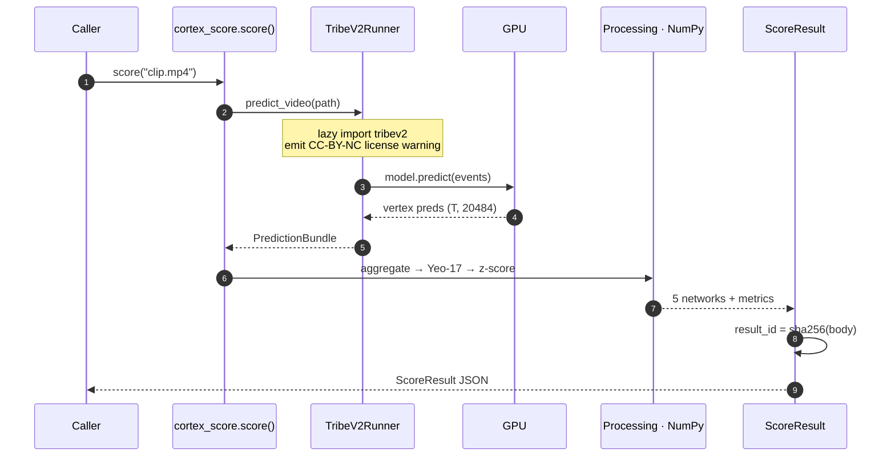

# cortex-score

Score any video for predicted cortical engagement across five brain networks.

`cortex-score` predicts how a video would activate different parts of the brain.
Drop in any mp4 and get back a JSON breakdown of how strongly five regions —
**visual, language, faces, attention, motion** — are likely to engage. The
numbers come from [Meta FAIR's TRIBE v2](https://huggingface.co/facebook/tribev2),
a model trained on fMRI scans of people watching videos.

> **Not a brain scan.** These are AI predictions, not measurements of any real
> viewer. Treat them as a creative signal, not a clinical one.

I built this to make a brain-encoding model usable from a few lines of Python.
It's a pre-release (v0.1) — not on PyPI yet.

**Useful for:**

- Ranking or filtering a video library by which clips engage which brain regions
- Building creative tools that need a richer signal than view count or watch time
- Researching what visual, linguistic, or social content a clip carries — without
  recording your own fMRI
- Dropping into AI-video pipelines as a content-understanding step before re-cuts,
  captions, or recommendations

## Two ways to use it

- **`score("clip.mp4")`** — full pipeline. Runs TRIBE v2 end-to-end on a GPU.
  Requires the `[gpu-deps]` extra plus TRIBE v2 itself (installed separately
  because PyPI rejects Git-URL deps).
- **`score_from_predictions(preds, ...)`** — CPU-only postprocessing. Hand it a
  `(T, 20484)` prediction tensor computed elsewhere; the package aggregates,
  normalizes, and emits the same JSON in milliseconds on a laptop.

## How it works


The vertex predictions are aggregated onto the Schaefer-400 / Yeo-17 atlas,
z-scored within the video, and rolled up into the five dashboard networks. Every
result carries its own provenance — model revision, atlas SHAs, normalization
scope, and license restrictions.

### Architecture



### Request lifecycle (`score()`)



## Getting started

### Install

```bash
pip install cortex-score                       # base · CPU postprocessing tier
pip install "cortex-score[cli]"                # + typer CLI
pip install "cortex-score[gpu-deps]"           # + TRIBE-compatible GPU matrix
pip install -r requirements/tribev2-gpu.txt    # + TRIBE v2 (pinned commit)
huggingface-cli login                          # gated LLaMA 3.2-3B
```

### Full pipeline

```python
from cortex_score import score

result = score("my_clip.mp4")
for net in result.networks:
    print(f"{net.id:>9}  mean={net.mean_energy:.3f}  peak={net.peak_energy:.3f}")
result.save("my_clip.score.json")
```

### CPU-only tier (no GPU)

```python
import numpy as np
from cortex_score import score_from_predictions

preds = np.load("preds_vertex.npy")  # (T, 20484) from any TRIBE v2 run
result = score_from_predictions(
    preds,
    mesh="fsaverage5",
    tr_seconds=1.0,
    hrf_lag_seconds=5.0,
    model_id="facebook/tribev2",
    model_revision="34f52344e5ba96660fac877393e1954e399d3ef3",
)
print(result.to_json(indent=2))
```

### Batch reuse

```python
from cortex_score import CortexScorer

scorer = CortexScorer()  # loads TRIBE v2 once
for clip in Path("clips").glob("*.mp4"):
    scorer.score(clip).save(out_dir / f"{clip.stem}.json")
```

### CLI

```bash
cortex-score doctor                # checks Python, torch, tribev2, ffmpeg, hf-token, cache dir
cortex-score schema > schema.json  # JSON Schema of ScoreResult
cortex-score cache info            # cache root + counts
```

## API

| Function | Use when |
|---|---|
| `score_from_prediction_bundle(bundle, *, config=, input_meta=)` | You built a validated `PredictionBundle` yourself (type-safe form) |
| `score_from_predictions(preds, *, mesh, tr_seconds, hrf_lag_seconds, model_id, model_revision, ...)` | You have a `(T, V)` NumPy tensor and want a friendly API |
| `score(video_path, *, runner=None, config=None)` | You have a video file; default runner is `TribeV2Runner` (needs `[gpu-deps]` + TRIBE) |
| `CortexScorer(runner=, config=)` | Batch scoring; loads TRIBE once and reuses |

### Bring your own encoder

`score()` is encoder-agnostic — implement the `PredictionRunner` protocol and pass
your own runner:

```python
from pathlib import Path
from cortex_score.schemas import PredictionBundle

class MyRunner:
    model_id: str = "my-org/my-encoder"
    model_revision: str = "v0.3"

    def predict_video(self, path: Path) -> PredictionBundle:
        ...  # your inference, return a PredictionBundle on fsaverage5
```

### Exceptions

| Exception | Raised when |
|---|---|
| `MissingOptionalDependencyError` | `[gpu-deps]` / `tribev2` missing when `score()` is called without a runner |
| `MissingExternalToolError` | `ffmpeg` / `uvx` absent on PATH at TRIBE-load time |
| `IncompatiblePredictionShapeError` | `preds.shape[1]` doesn't match the mesh's vertex count |
| `AtlasMismatchError` | Bundled atlas SHA-256 disagrees with `data/manifest.json` (corrupted wheel) |

## Output

Every score is a self-describing JSON object. The contract is locked behind
`SCHEMA_VERSION = "1.0"`; any breaking change bumps it explicitly.

| Field | What it gives you |
|---|---|
| `result_id` | SHA-256 of the payload — a stable id for caches, audit logs, dedup |
| `provenance.model_revision` | Which TRIBE v2 commit produced the numbers |
| `atlas.*_sha256` | Fingerprints of the exact Schaefer / Yeo / network-group data used |
| `normalization.scope` | `within_video` by default — two clips aren't comparable on the same axis unless you opt into a reference distribution |
| `license_restrictions[]` | TRIBE v2 CC-BY-NC-4.0 recorded in-band so downstream code can't lose track of it |
| `input.filename` / `absolute_path` | Basename only by default; absolute path is opt-in to keep shareable JSON free of local paths |

```jsonc
{
  "schema_version": "1.0",
  "result_id":      "<sha256 of canonical body>",
  "created_at":     "2026-05-22T02:53:55Z",
  "input":          { "filename": "...", "absolute_path": null, "content_sha256": "..." },
  "timing":         { "tr_seconds": 1.0, "hrf_lag_seconds": 5.0, "n_segments": 6 },
  "normalization":  { "method": "zscore", "scope": "within_video", "epsilon": 1e-6 },
  "atlas":          { "atlas_sha256": "...", "yeo_atlas_sha256": "...", "network_groups_sha256": "..." },
  "provenance":     { "model_revision": "34f52344e5ba…", "torch_version": "2.6.0+cu124" },
  "license_restrictions": [ { "component": "TRIBE v2", "license": "CC-BY-NC-4.0" } ],
  "networks": [
    { "id": "visual",    "yeo_indices": [0, 1],     "mean_energy": 0.748, "peak_energy": 2.149 },
    { "id": "language",  "yeo_indices": [11, 16],   "mean_energy": 0.890, "peak_energy": 1.320 },
    { "id": "faces",     "yeo_indices": [7, 15],    "mean_energy": 0.838, "peak_energy": 1.690 },
    { "id": "attention", "yeo_indices": [4,5,6,10], "mean_energy": 0.816, "peak_energy": 1.596 },
    { "id": "motion",    "yeo_indices": [2, 3],     "mean_energy": 0.747, "peak_energy": 2.082 }
  ]
}
```

## Network palette

The five-network grouping is **product design, not canonical neuroscience** — its
provenance is recorded as `network_group_source: "cortexia-network-groups-v1"` in
every result and SHA-fingerprinted in `data/manifest.json`. The hex values are
embedded in `network_groups.json` and exposed via `NetworkScore.color`.

| Network | Hex | Yeo parcels |
|---|---|---|
| visual | `#5BC0EB` | `VisCent`, `VisPeri` |
| language | `#FFB627` | `ContB`, `TempPar` |
| faces | `#E55D87` | `SalVentAttnB`, `DefaultC` |
| attention | `#9BC53D` | `DorsAttnA`, `DorsAttnB`, `SalVentAttnA`, `ContA` |
| motion | `#7E5BEF` | `SomMotA`, `SomMotB` |

## Tech stack

- **Python 3.11+** — matches TRIBE v2's `requires-python`
- **Pydantic v2** — frozen models, `extra="forbid"`, free JSON Schema export
- **hatchling + hatch-vcs** — git-tag-driven versioning
- **typer** — optional `[cli]` extra; degrades gracefully if not installed
- **platformdirs** — XDG / `%LOCALAPPDATA%` cache dirs, override via `CORTEX_SCORE_CACHE_DIR`
- **Bundled atlas** — Schaefer 2018 + Yeo 2011 on fsaverage5, SHA-256 fingerprinted (~337 KB)
- **Encoder** — TRIBE v2 @ `34f52344` (Llama 3.2-3B + V-JEPA2 + W2V-BERT), pinned to commit
- **Tests** — `pytest` + `hypothesis`, 125 tests at 87.95% coverage, `ruff` + `mypy --strict` clean

## Licenses

This repository has **two layers of licensing** — read both before commercial use.

| Layer | License | Applies to |
|---|---|---|
| Source code | **MIT** | The `cortex_score` Python package |
| Schaefer 2018 atlas | MIT (CBIG) | `data/schaefer400_vertex.npy`, `labels_schaefer400.json` |
| Yeo 2011 atlas | FreeSurfer (BSD-like) | `data/yeo17_vertex.npy`, `labels_yeo17.json` |
| 5-network grouping | MIT (Cortexia) | `data/network_groups.json` |
| **TRIBE v2 model** | **CC-BY-NC-4.0** | Outputs from the full `score()` pipeline inherit the non-commercial restriction |

See [`LICENSE-THIRD-PARTY.md`](LICENSE-THIRD-PARTY.md) for the full notice. The
CC-BY-NC warning is also emitted as a Python `UserWarning` on first TRIBE load and
recorded in every `ScoreResult.license_restrictions`.

## Reproducibility

Smoke-test numbers from a Modal A100 run on a 5.3 s short-form vertical clip:

| Metric | Value |
|---|---|
| GPU runtime | 175.5 s |
| Wall clock (incl. cold start) | 184.5 s |
| Estimated GPU spend | $0.11 |
| Peak VRAM | 10.80 GB |
| TRIBE v2 commit | `34f52344e5ba96660fac877393e1954e399d3ef3` |

```bash
modal run examples/modal_smoke.py
```

---

MIT-licensed source · CC-BY-NC-4.0 model outputs · built by
[Madhav Chauhan](https://github.com/madhavcodez).
